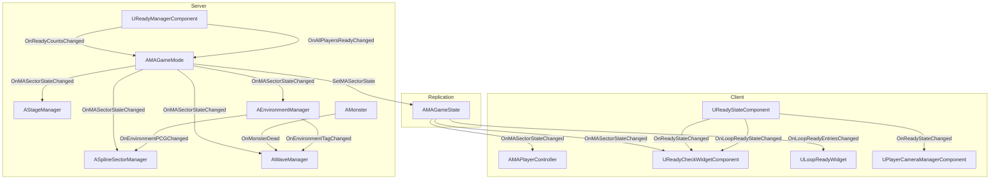

# Manager Communication Flow

```mermaid
flowchart TD
    subgraph Server
        GM[AMAGameMode]
        RMC[UReadyManagerComponent]
        SSM[ASplineSectorManager]
        STG[AStageManager]
        WAV[AWaveManager]
        ENV[AEnvironmentManager]
        MON[AMonster]
    end

    subgraph Replication
        GS[AMAGameState]
    end

    subgraph Client
        PC[AMAPlayerController]
        RCWC[UReadyCheckWidgetComponent]
        LRW[ULoopReadyWidget]
        CAM[UPlayerCameraManagerComponent]
        RSC[UReadyStateComponent]
    end

    RMC -->|OnReadyCountsChanged| GM
    RMC -->|OnAllPlayersReadyChanged| GM

    GM -->|OnMASectorStateChanged| SSM
    GM -->|OnMASectorStateChanged| STG
    GM -->|OnMASectorStateChanged| WAV
    GM -->|OnMASectorStateChanged| ENV

    MON -->|OnMonsterDead| WAV

    ENV -->|OnEnvironmentTagChanged| WAV
    ENV -->|OnEnvironmentPCGChanged| SSM

    GM -->|SetMASectorState| GS

    GS -->|OnMASectorStateChanged| PC
    GS -->|OnMASectorStateChanged| RCWC
    GS -->|OnLoopReadyEntriesChanged| LRW

    RSC -->|OnReadyStateChanged| RCWC
    RSC -->|OnLoopReadyStateChanged| RCWC
    RSC -->|OnReadyStateChanged| CAM
```

